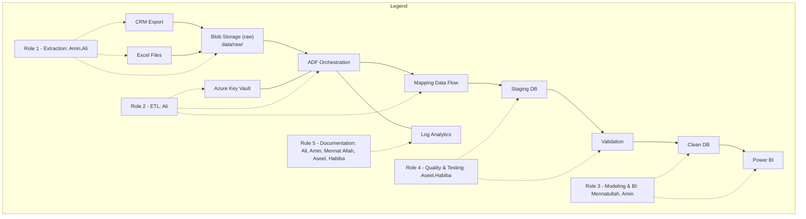
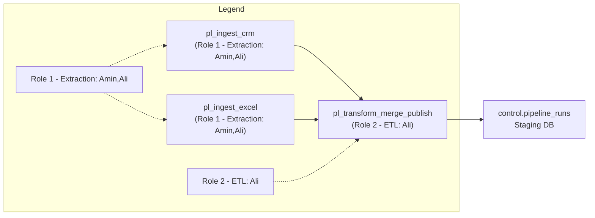
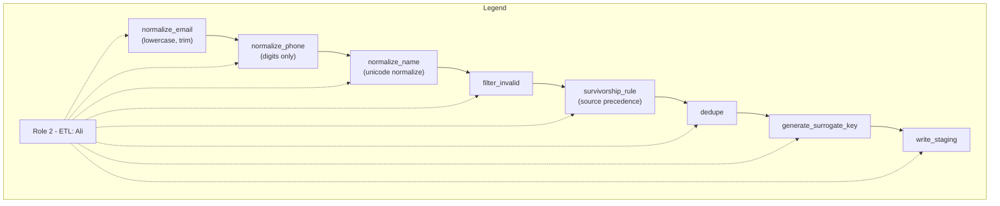
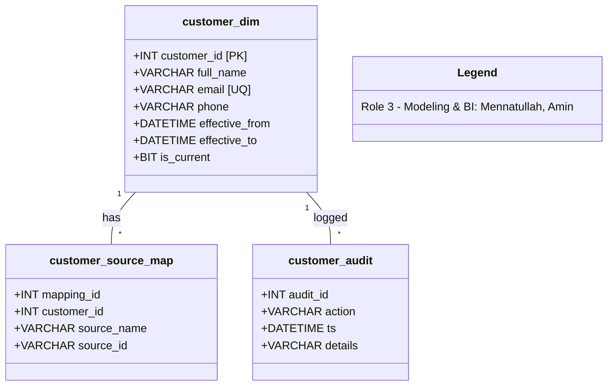
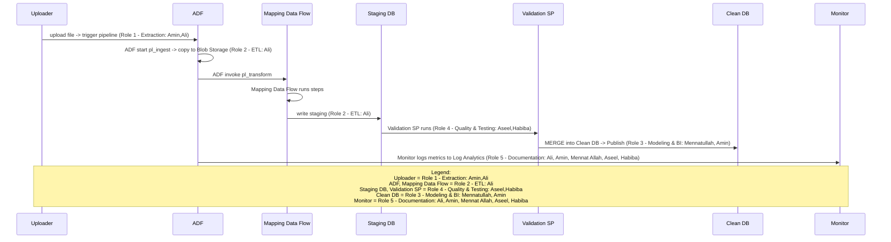
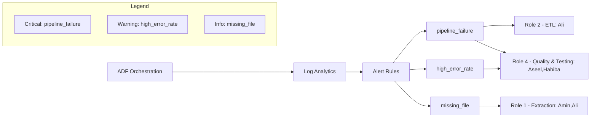
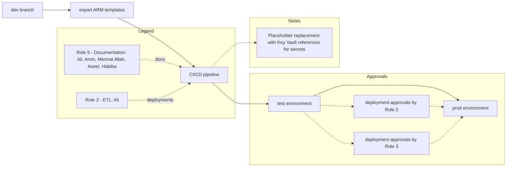
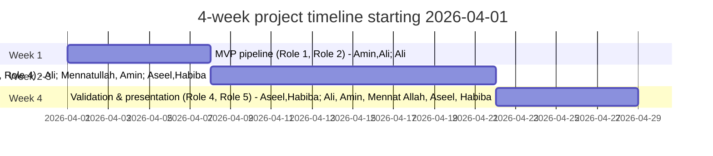
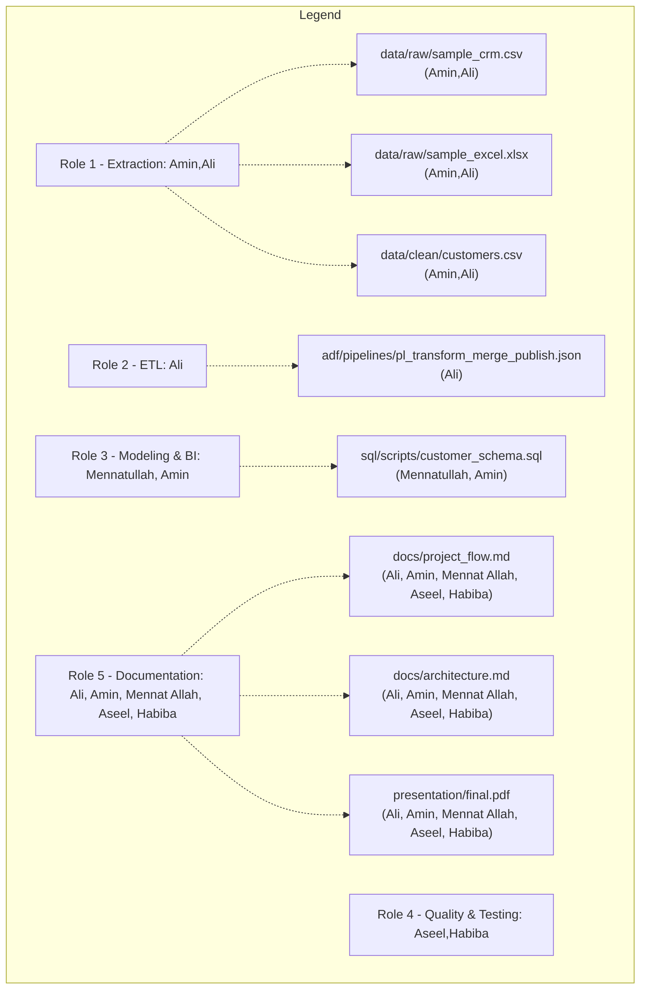

# ETL Planning Diagrams (Mermaid)

High-level system architecture.
<!-- ALT: high-level architecture -->

Notes: Edit storage paths.

Role-linked pipeline flow with pipeline ownership.
<!-- ALT: role-linked pipeline flow -->

Notes: Set pipeline names.

In-depth transformation steps inside Mapping Data Flow.
<!-- ALT: mapping data flow steps -->

Notes: Edit normalization rules.

Final clean schema ERD, SCD2 indicated.
<!-- ALT: final clean schema ERD -->

Notes: Set data types as needed.

Sequence of activities for one pipeline run with owners.
<!-- ALT: pipeline sequence diagram -->

Notes: Edit actor names.

Monitoring and alerting responsibilities and escalation.
<!-- ALT: monitoring and alerting flow -->

Notes: Set alert recipients.

CI/CD pipeline for ADF and SQL artifacts.
<!-- ALT: CI/CD and deployment flow -->

Notes: Replace placeholders with Key Vault secrets.

4-week project timeline starting 2026-04-01.
<!-- ALT: project timeline gantt -->

Notes: Edit start date.

Deliverables checklist with owners.
<!-- ALT: deliverables checklist -->

Notes: Update file names if changed.
