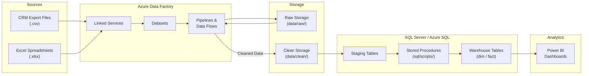
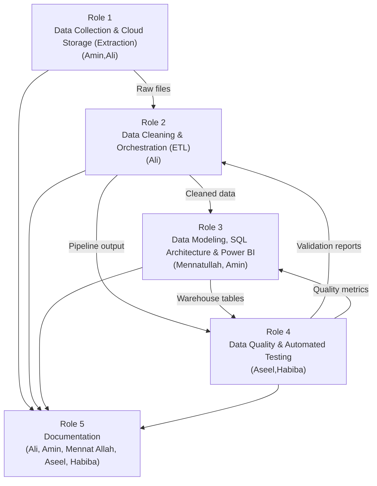

# Project Workflow & Architecture Guide

## ETL for Customer Data from Multiple Sources

**DEPI Final Project — Digital Egypt Pioneers Initiative**

> **Team:** Ali · Amin · Mennat Allah · Aseel · Habiba

---

## Table of Contents

1. [Project Overview](#1--project-overview)
2. [Architecture Overview](#2--architecture-overview)
3. [Required Knowledge & Prerequisites](#3--required-knowledge--prerequisites)
4. [Initial Data Requirements](#4--initial-data-requirements)
5. [ETL Pipeline Design](#5--etl-pipeline-design)
6. [Folder Responsibilities](#6--folder-responsibilities)
7. [Team Roles & Responsibilities](#7--team-roles--responsibilities)
8. [Iterative Project Plan (4 Weeks)](#8--iterative-project-plan-4-weeks)
9. [Deliverables](#9--deliverables)
10. [Success Criteria](#10--success-criteria)

---

## 1 — Project Overview

### The Business Problem

Organizations rarely maintain a single, unified view of their customers. In practice, customer information is scattered across multiple systems — a CRM platform captures leads and interactions, while business teams track regional accounts, campaigns, and on-the-ground contacts in Excel spreadsheets. When these datasets live in isolation, the organization suffers from **data silos**: duplicated records, conflicting contact details, missing demographic fields, and an inability to answer even basic questions such as *"How many unique customers do we actually have?"*

### Why Customer Data Integration Matters

Accurate, consolidated customer data is the foundation of effective business intelligence. Without it, marketing campaigns target the wrong audience, sales teams waste effort on duplicate leads, and executive dashboards present misleading numbers. A well-engineered data integration pipeline eliminates these problems by creating a **single source of truth** — one clean, validated, and deduplicated dataset that every downstream consumer (analyst, dashboard, or machine-learning model) can trust.

### Objective of the ETL Pipeline

This project delivers an **end-to-end Extract, Transform, Load (ETL) pipeline** that:

1. **Extracts** customer records from two heterogeneous sources — CRM export files (CSV) and Excel spreadsheets maintained by business teams.
2. **Transforms** the raw data by standardizing column names, resolving format inconsistencies, handling null values, removing duplicate records, and merging related rows across sources.
3. **Loads** the cleaned, unified dataset into a structured SQL data warehouse ready for analytical queries and visual reporting.

The pipeline is orchestrated on **Azure Data Factory**, with transformation logic implemented in **SQL Server / Azure SQL**, and the final analytical layer consumed through **Power BI** dashboards.

### Expected Analytical Outcomes

Once the pipeline is operational the team — and any future stakeholder — will be able to:

- Determine the **total number of unique customers** across all sources.
- Identify **regional distribution** of the customer base.
- Track **sign-up trends** over time.
- Detect **data-quality issues** (e.g., percentage of records missing an email address) and monitor improvements across pipeline iterations.
- Drive **data-informed decisions** through interactive Power BI dashboards that refresh automatically as new source data arrives.

---

## 2 — Architecture Overview

### High-Level Data Flow

The architecture follows a classic **three-layer ETL pattern**:

| Layer | Technology | Purpose |
|---|---|---|
| **Source** | CRM exports (CSV), Excel files | Raw operational data |
| **Ingestion & Orchestration** | Azure Data Factory | Schedule, extract, and move data |
| **Storage — Raw** | `data/raw/` (Blob / local) | Untouched landing zone |
| **Transformation** | ADF Data Flows + SQL scripts | Clean, merge, validate |
| **Storage — Clean** | Azure SQL / SQL Server | Structured warehouse tables |
| **Analytics** | Power BI | Dashboards and reports |

Data flows **left to right** through these layers. No downstream layer ever writes back to an upstream layer, guaranteeing a clean, reproducible lineage.

### Architecture Diagram

### Flow Summary

1. **CRM and Excel files** are collected and placed into `data/raw/`.
2. **Azure Data Factory** picks up the files through configured **Linked Services** and **Datasets**.
3. **ADF Pipelines / Data Flows** apply transformation rules — field mapping, null handling, deduplication, and type casting.
4. Cleaned output lands in `data/clean/` and is loaded into **SQL staging tables**.
5. **SQL stored procedures** perform final merges, upserts, and dimensional modeling into warehouse tables.
6. **Power BI** connects to the warehouse and renders interactive dashboards for stakeholders.

---

## 3 — Required Knowledge & Prerequisites

Before diving into implementation, every team member should be comfortable with the foundational concepts listed below. The list is organized by discipline so individuals can self-assess and fill gaps early.

### 3.1 Data Engineering Concepts

| Concept | Why It Matters |
|---|---|
| **ETL vs ELT** | Understanding the difference between transforming data *before* loading (ETL) and *after* loading (ELT) helps the team choose the right strategy for each transformation step. This project primarily follows ETL because transformations are applied in ADF before data reaches the warehouse. |
| **Data Pipelines** | A pipeline is an automated, repeatable sequence of data processing steps. Knowing how to design, trigger, and monitor pipelines is the core skill for this project. |
| **Data Validation** | Ensuring data meets defined quality rules (non-null fields, valid email formats, referential integrity) prevents bad data from reaching consumers. |
| **Data Modeling** | Designing tables, relationships, and keys in a warehouse schema (star or snowflake) determines how efficiently analysts can query the data. |

### 3.2 Cloud & Azure Concepts

| Concept | Why It Matters |
|---|---|
| **Azure Data Factory (ADF)** | The orchestration engine for the entire pipeline. Team members should understand the ADF authoring UI, pipeline triggers, and monitoring dashboards. |
| **Linked Services** | Connections to external systems (Blob Storage, SQL Server, file shares). Each data source and destination requires a linked service. |
| **Datasets** | Logical representations of the data structures used in pipelines. Datasets define schema, file format, and location. |
| **Pipelines & Activities** | The unit of orchestration. A pipeline contains activities (copy, data flow, stored procedure) that execute in sequence or parallel. |

### 3.3 Data & SQL Skills

| Concept | Why It Matters |
|---|---|
| **SQL Fundamentals** | `SELECT`, `JOIN`, `GROUP BY`, `INSERT`, `UPDATE`, `MERGE` — the core language used for all warehouse transformations. |
| **Data Cleaning Techniques** | Trimming whitespace, normalizing phone numbers, parsing dates, and handling `NULL` values are daily tasks in this project. |
| **Deduplication Strategies** | Identifying and resolving duplicate customer records across sources requires fuzzy matching, deterministic rules, or both. |

### 3.4 Analytics & Visualization

| Concept | Why It Matters |
|---|---|
| **Power BI Basics** | Connecting to a SQL data source, building relationships in the data model, and creating visuals (bar charts, KPI cards, slicers). |
| **Data Visualization Best Practices** | Choosing the right chart type, labeling axes, and designing for clarity ensure dashboards are actionable, not just decorative. |

---

## 4 — Initial Data Requirements

### 4.1 CRM Export Dataset

The CRM system exports customer records as CSV files. A typical export includes the following fields:

| Field | Type | Example |
|---|---|---|
| `customer_id` | Integer | `10234` |
| `name` | String | `Ahmed Hassan` |
| `email` | String | `ahmed.h@example.com` |
| `phone` | String | `+201012345678` |
| `signup_date` | Date | `2024-11-15` |

CRM files are expected to land in `data/raw/crm/` with a naming convention such as `crm_export_YYYYMMDD.csv`.

### 4.2 Excel Dataset from Business Teams

Business teams maintain Excel workbooks with regional customer lists. A representative sheet contains:

| Field | Type | Example |
|---|---|---|
| `full_name` | String | `Ahmed M. Hassan` |
| `email_address` | String | `ahmed.hassan@example.com` |
| `country` | String | `Egypt` |
| `phone_number` | String | `01012345678` |

Excel files are expected in `data/raw/excel/` with descriptive names such as `region_cairo_customers.xlsx`.

### 4.3 Common Data Quality Issues

The team should anticipate — and the pipeline must handle — the following issues in incoming data:

- **Duplicate Records:** The same customer may appear in both the CRM export and the Excel sheet, possibly with slight name variations (e.g., "Ahmed Hassan" vs. "Ahmed M. Hassan").
- **Missing Emails:** Some records will have `NULL` or empty email fields. The pipeline must flag these for review rather than silently dropping them.
- **Inconsistent Phone Formats:** CRM may store `+201012345678` while Excel stores `01012345678`. A normalization step must standardize formats before deduplication.
- **Date Format Mismatches:** CRM dates may be `YYYY-MM-DD` while Excel dates may arrive as serial numbers or `DD/MM/YYYY` strings.
- **Inconsistent Naming:** Column names differ between sources (`name` vs. `full_name`, `email` vs. `email_address`). The transformation layer must map these to a common schema.

---

## 5 — ETL Pipeline Design

The pipeline is decomposed into six sequential stages. Each stage has a clear input, transformation responsibility, and output.

### Stage 1 — Data Extraction

**Purpose:** Retrieve raw data from its original sources and land it in the project's raw storage zone.

**Details:**
- CRM exports are obtained as CSV files (manual download or automated SFTP pull, depending on CRM capabilities).
- Excel files are collected from business teams through a shared folder or email attachment workflow.
- ADF **Copy Activities** move files from the source locations into `data/raw/`, preserving the original file name and appending a timestamp to enable versioning.

**Output:** Untouched source files stored in `data/raw/crm/` and `data/raw/excel/`.

---

### Stage 2 — Raw Data Storage

**Purpose:** Maintain an immutable landing zone so the team can always trace back to the original source.

**Details:**
- Files in `data/raw/` are **never modified** after landing. If a new version of a source file arrives, it is stored alongside the previous version.
- This enables auditability and reproducibility — if a downstream bug is discovered, the team can re-run the pipeline from the original data.

**Output:** A versioned archive of all source files.

---

### Stage 3 — Transformation

**Purpose:** Standardize, normalize, and reshape data into a common schema.

**Details:**
- **Column Mapping:** Rename source-specific columns to a unified naming convention (e.g., `full_name` → `name`, `email_address` → `email`).
- **Type Casting:** Convert string dates to proper `DATE` types, ensure phone numbers are stored as strings (to preserve leading zeros), and cast IDs to integers.
- **Normalization:** Standardize phone number formats to E.164 (`+20XXXXXXXXXX`), trim whitespace from all string fields, and normalize casing for email addresses (lowercase).

**Output:** Intermediate transformed datasets with consistent schema and data types.

---

### Stage 4 — Data Cleaning

**Purpose:** Remove or flag records that do not meet quality thresholds.

**Details:**
- **Null Handling:** Records missing critical fields (`customer_id`, `name`) are routed to a rejected-records log. Records missing optional fields (`phone`) are retained with nulls.
- **Deduplication:** Within each source, remove exact duplicates. Across sources, apply deterministic matching on email (primary key for merge) and fuzzy matching on name + phone as a fallback.
- **Outlier Detection:** Flag records with obviously invalid data (e.g., signup dates in the future, phone numbers with fewer than 8 digits).

**Output:** A clean, deduplicated dataset and a separate log of rejected/flagged records for manual review.

---

### Stage 5 — Data Validation

**Purpose:** Verify that the cleaned dataset meets predefined quality rules before loading into the warehouse.

**Details:**
- **Row-Count Checks:** The number of output rows should be within an expected range relative to input rows. A sudden 50% drop indicates a pipeline bug, not a data quality win.
- **Null-Rate Checks:** Critical columns must have a null rate below a defined threshold (e.g., `email` < 5% null).
- **Uniqueness Checks:** `customer_id` and `email` must be unique in the final output.
- **Referential Integrity:** If dimensional tables exist (e.g., `dim_country`), all `country` values in the fact table must have a matching entry.

**Output:** A validation report (pass/fail per rule) and a go/no-go signal for the load stage.

---

### Stage 6 — Data Loading

**Purpose:** Insert the validated dataset into the SQL data warehouse.

**Details:**
- Data is first loaded into **staging tables** (`stg_customers`) using a truncate-and-reload pattern.
- A **stored procedure** performs a `MERGE` (upsert) from staging into the final warehouse table (`dim_customer`), inserting new records and updating changed records.
- Load timestamps and row counts are logged for monitoring.

**Output:** Populated warehouse tables ready for Power BI consumption.

---

## 6 — Folder Responsibilities

Each folder in the repository has a specific purpose. Following this structure keeps the project organized and makes it easy for any team member to find what they need.

| Folder | Purpose | Typical Contents |
|---|---|---|
| `data/raw/` | **Immutable landing zone** for source files. Nothing here is ever modified after initial placement. | `crm_export_20250301.csv`, `region_cairo_customers.xlsx` |
| `data/clean/` | **Processed outputs** ready for loading into the warehouse or for ad-hoc analysis. | `customers_cleaned_20250305.csv` |
| `adf/pipelines/` | **ADF pipeline definitions** exported as JSON. These define the orchestration logic — what runs, in what order, and with what parameters. | `pipeline_crm_ingest.json`, `pipeline_transform.json` |
| `adf/datasets/` | **ADF dataset definitions** describing the schema and location of data sources and sinks. | `ds_crm_csv.json`, `ds_sql_staging.json` |
| `adf/linked_services/` | **ADF linked service definitions** — connection strings and authentication details (secrets redacted) for external systems. | `ls_blob_storage.json`, `ls_azure_sql.json` |
| `sql/scripts/` | **SQL scripts** for schema creation, data transformation, stored procedures, and validation queries. | `create_tables.sql`, `sp_merge_customers.sql`, `validate_nulls.sql` |
| `docs/` | **Project documentation** including this workflow guide and the main README. | `README.md`, `project_flow.md` |
| `wiki/` | **Extended documentation** covering architecture deep-dives, data-source profiles, glossary, and other reference material. | `Project-Architecture.md`, `ETL-Pipeline.md`, `Glossary.md` |

---

## 7 — Team Roles & Responsibilities

The team operates in five collaborative roles. Some members share a role; everyone contributes to documentation.

| Role | Owners | Key Responsibilities |
|---|---|---|
| **Role 1 — Data Collection & Cloud Storage (Extraction)** | Amin,Ali | Collect and profile CRM and Excel source files. Organize source files in `data/raw/`. Prepare storage structure for raw/bronze layer. |
| **Role 2 — Data Cleaning & Orchestration (ETL)** | Ali | Build ADF linked services, datasets, and pipelines. Implement Data Flows to merge CRM + Excel, handle nulls, standardize types, and deduplicate. Move processed output to `data/clean/`. |
| **Role 3 — Data Modeling, SQL Architecture & Power BI** | Mennatullah, Amin | Design target warehouse schema and maintain table/load scripts in `sql/scripts/`. Add SQL procedures for update/upsert behavior. Connect Power BI to the cleaned data/warehouse to build interactive dashboards and visualizations. |
| **Role 4 — Data Quality & Automated Testing** | Aseel,Habiba | Define data quality checks (nulls, duplicates, row counts). Create validation SQL scripts and rejected/bad-row logging approach. Add basic pipeline error-handling checks. |
| **Role 5 — Documentation** | Ali, Amin, Mennat Allah, Aseel, Habiba | Document lineage and progress in `docs/README.md` and `docs/project_flow.md`. |

### Collaboration Model

---

## 8 — Iterative Project Plan (4 Weeks)

The project follows an **iterative delivery model**. Each cycle produces a working (if incomplete) pipeline, and subsequent cycles refine and extend it. This approach reduces risk and ensures the team always has a demonstrable output.

---

### Week 1 — Minimum Viable Pipeline (MVP)

**Goal:** Deliver the first working end-to-end pipeline using a small sample dataset.

| Role | Week 1 Tasks |
|---|---|
| Extraction | Place 2–3 sample CRM and Excel files in `data/raw/`. Profile source fields and document findings. |
| ETL | Build the first ADF pipeline: Copy Activity from `data/raw/` → simple Data Flow → `data/clean/`. |
| Modeling | Draft the initial `CREATE TABLE` scripts for staging and warehouse tables in `sql/scripts/`. |
| Quality | Validate the first cleaned output: check row counts, spot-check 10 records manually. |
| Documentation | Set up `docs/README.md` and `docs/project_flow.md`. Document initial architecture decisions. |

**Milestone:** A first successful pipeline run producing at least one cleaned output file in `data/clean/`.

---

### Weeks 2–3 — Scaling & Transformation

**Goal:** Move from sample data to full-scale data. Implement all transformation rules, deduplication, and merge logic.

| Role | Weeks 2–3 Tasks |
|---|---|
| Extraction | Replace sample files with complete CRM and Excel datasets. Add any newly discovered source files. |
| ETL | Implement column mapping, type casting, phone normalization, and cross-source deduplication in ADF Data Flows. Automate pipeline triggers. |
| Modeling | Finalize warehouse schema. Implement `MERGE` stored procedures for upsert behavior. |
| Quality | Implement automated validation queries (null rates, uniqueness, row-count thresholds). Set up rejected-record logging. |
| Documentation | Record issues, design decisions, and changes in `wiki/`. Update architecture diagrams. |

**Milestone:** A stable, repeatable pipeline that processes full datasets and loads validated records into the warehouse.

---

### Week 4 — Validation, Dashboards & Presentation

**Goal:** Freeze the pipeline, finalize dashboards, and prepare the DEPI presentation.

| Role | Week 4 Tasks |
|---|---|
| Extraction | Perform a final source data refresh. Confirm all source files are versioned in `data/raw/`. |
| ETL | Finalize pipeline parameters, error handling, and retry logic. Document run instructions. |
| Modeling | Connect Power BI to the warehouse. Build 2–3 key dashboards (customer overview, data quality, sign-up trends). |
| Quality | Execute the full validation checklist. Sign off on data quality. Produce a final quality report. |
| Documentation | Prepare the final presentation deck. Write the project narrative for portfolio use. Ensure all `wiki/` pages are complete. |

**Milestone:** A portfolio-ready project with clean data, working dashboards, complete documentation, and a polished presentation.

---

### Progress Tracker

Update this table at the end of each week:

| Week | Focus | Status |
|---|---|---|
| Week 1 | MVP pipeline with sample data | `Planned` / `Active` / `Complete` |
| Weeks 2–3 | Full data load + automated transformations | `Planned` / `Active` / `Complete` |
| Week 4 | Validation, dashboards, and presentation | `Planned` / `Active` / `Complete` |

---

## 9 — Deliverables

The following artifacts constitute the final project submission:

| # | Deliverable | Description | Location |
|---|---|---|---|
| 1 | **Cleaned Customer Dataset** | A unified, deduplicated, and validated customer dataset produced by the pipeline. | `data/clean/` |
| 2 | **ADF Pipeline Design** | Exported pipeline, dataset, and linked-service JSON definitions with documentation of each activity's purpose. | `adf/` |
| 3 | **SQL Schema & Scripts** | Table creation scripts, stored procedures for data loading and transformation, and validation queries. | `sql/scripts/` |
| 4 | **Power BI Dashboard** | An interactive dashboard connected to the warehouse, showing customer overview, regional distribution, sign-up trends, and data quality metrics. | Shared via Power BI Service or `.pbix` file |
| 5 | **Project Documentation** | Architecture overview, pipeline design documentation, data-source profiles, glossary, and this workflow guide. | `docs/` and `wiki/` |
| 6 | **Final Presentation** | A slide deck summarizing the business problem, architecture, pipeline design, results, and lessons learned — ready for the DEPI evaluation panel. | Shared via Google Slides / PowerPoint |

---

## 10 — Success Criteria

The project will be evaluated against the following criteria. Each criterion has a measurable target to remove ambiguity.

### Data Accuracy

| Metric | Target |
|---|---|
| Duplicate customer rate in final dataset | **< 1%** |
| Null rate for critical fields (`name`, `email`) | **< 5%** |
| Phone number format compliance (E.164) | **> 95%** |
| Date field validity (no future dates, no nulls) | **100%** |

### Pipeline Reliability

| Metric | Target |
|---|---|
| End-to-end pipeline completes without manual intervention | **Yes** |
| Pipeline produces consistent output on re-run with same input | **Yes** |
| Rejected records are logged, not silently dropped | **Yes** |
| Pipeline handles empty source files gracefully (no crash) | **Yes** |

### Documentation Completeness

| Metric | Target |
|---|---|
| All `wiki/` pages are populated and reviewed | **Yes** |
| Architecture diagram matches implemented pipeline | **Yes** |
| SQL scripts include inline comments | **Yes** |
| README contains setup and run instructions | **Yes** |

### Analytical Value

| Metric | Target |
|---|---|
| Power BI dashboard answers at least 3 business questions | **Yes** |
| Dashboard refreshes correctly from warehouse data | **Yes** |
| Data quality metrics are visible in the dashboard | **Yes** |

---

> **Last updated:** 2025-03-16 — Project kickoff version.
